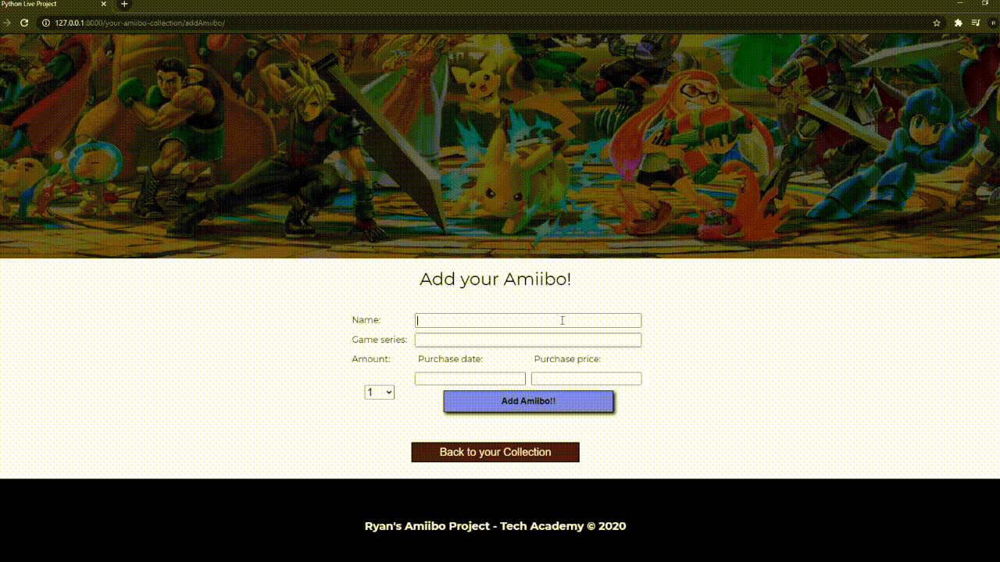
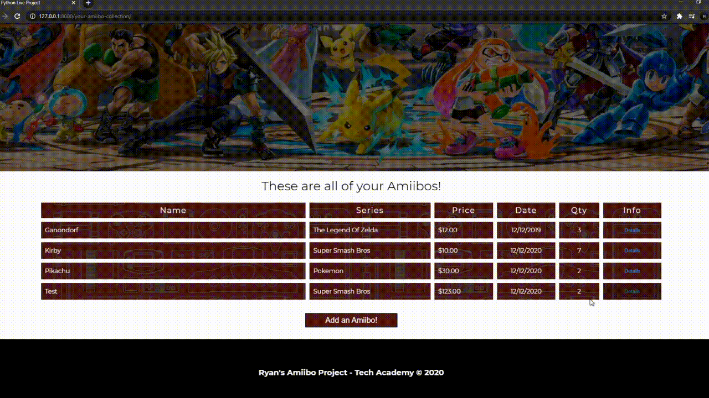

# **<p align="center">Amiibo Collector</p>**
For this project, I created a Django application. This app is themed around Amiibos.  You can create, edit, and delete your Amiibos and search for more Amiibos.  I use the [AmiiboApi](https://www.amiiboapi.com/) to search for all available Amiibos and display them on the page.  You can also look at general Nintendo news.  This page web scrapes [nintendonews.com](https://nintendonews.com/) for the latest Nintendo articles.

The database that I am using to store the Amiibos is a local database using **SQLite**.  To contact the API, I am using Python's **requests** module.  For web scraping, I am using **Beautiful Soup**.

* **[CRUD Pages](#crud-pages)**
    * [Index](#Index)
    * [Create](#Create)
    * [Details](#Details)
    * [Edit](#Edit)
    * [Delete](#Delete)
* **AmiiboApi**
* **Web Scraping (Beautiful Soup)**

# <p align="center" name="crud-pages">CRUD Pages</p>
**<p align="center" name="Index">Index Page</p>**
The Index page displays all of the Amiibos stored in the database.  The Amiibo information is organized in a table.  From the table you can also view more details about an Amiibo by clicking the details button on the left.

The View is pretty straight-forward: Get all of the Amiibos saved in the database with `AmiiboFigure.AmiiboFigurines.all()` and send it to the template.  `AmiiboFigure` is the model representing an Amiibo and `AmiiboFigurines` is that model's model manager.

```python
# Called when Amiibo/urls.py sees  'yourcollection'  at the end of the URL
# Returns the HTML file amiibo_db.html which shows the contents of the database.
def amiibo_db(request):
    # NEW FEATURE: When user clicks "Add Amiibo" on the addAmiibo page they are taken to their collection.
    # When the ModelForm is POSTed here, save it in the database.
    form = AmiiboFigureForm(request.POST or None)
    if form.is_valid():
        form.save()

    amiibos = AmiiboFigure.AmiiboFigurines.all()        # Put all of the variables in the db into the variable

    context = {
        'amiibos': amiibos,
    }

    return render(request, 'Amiibo/amiibo_db.html', context)
```

<p align="center">
    
</p>


**<p align="center" name="Create">Create Page</p>**
On the Create page, the user enters in the Amiibo name, game series, purchase date, purchase amount, and the quantity.  After the form is submitted, the `amiibo_db` method is called which saves the Amiibo if the form is valid.

<p align="center">
    
</p>


**<p align="center" name="Details">Details Page</p>**
Clicking on the details button on the Index page will bring you to this page.  Here, you can see the image associated with your Amiibo *(future feature: use the AmiiboAPI to get the image)* and all of the other information associated with that Amiibo.

The view for the details page is pretty simple.  First, we need to pass the primary key up to the amiibo_details method so that we can get the Amiibo object from the database.  Once we have the Amiibo, we can send it to the details page.

```python
# Called when Amiibo/urls.py sees  'yourcollection/details'  at the end of the URL
# Gets the AmiiboFigure instance that was clicked and sends it to details page.
# Returns the HTML file amiibo_db-details.html
def amiibo_details(request, pk):
    # I'll determine what amiibo to show details of based on its primary key.
    pk = int(pk)    # Make sure it's an integer.
    amiibo = get_object_or_404(AmiiboFigure, pk=pk)

    context = {
        'amiibo': amiibo
    }

    # When the primary key is passed to this function, the corresponding amiibo is retrieved and
    # sent to amiibo_db-details.html.
    return render(request, 'Amiibo/amiibo_db-details.html', context)
```

<p align="center">
    
</p>


**<p align="center" name="Edit">Edit Page</p>**
To Edit an Amiibo, click the 'Edit Amiibo' button on the details page.  The edit page displays a form populated with that particular Amiibo's information.  Editing some of the values in the fields and clicking 'Confirm Changes' will edit that Amiibo.

The method in the view should only save the changes to the database if we received a POST request.  After getting the form data using a model form `AmiiboFigureForm`, we determine if the form is valid.  If so, save the Amiibo information from the form and render the Index page.

<sub>↓</sub> *This is only a section of the amiibo_edit method, not the entire method* <sub>↓</sub>

```python
# If there was a POST sent here, update the amiibo information
if request.method == "POST":
    # Initialize the form with the Amiibo's current information
    form = AmiiboFigureForm(request.POST, instance=amiibo)

    # IF the form is valid, save it to the database and return to your collection
    if form.is_valid():
        # Once the form is submitted and valid, overwrite the information in amiibo and update the DB.
        amiibo = form.save(commit=False)
        amiibo.save()

        amiibos = AmiiboFigure.AmiiboFigurines.all()

        context = {
            'amiibos': amiibos,
            'AmiiboUpdateMessage': "{} was edited!".format(amiibo),
        }

        return render(request, 'Amiibo/amiibo_db.html', context)
```

<p align="center">
    
</p>


**<p align="center" name="Delete">Delete Modal</p>**
Instead of a separate made for the delete feature, I created a modal.  On the details page of any Amiibo, clicking the 'Delete Amiibo' button will bring up the modal.  Confirming will delete the Amiibo from the database and bring you back to the Index page.

The primary key of the Amiibo is passed to the amiibo_delete method in the view.  In the view, the Amiibo is found and deleted.  Since we want to Render the Index page, we get all of the Amiibos from the database and send it to the Index page.

```python
# Deletes the selected Amiibo then returns back to your collection.
def amiibo_delete(request, pk):
    pk = int(pk)

    amiibo = get_object_or_404(AmiiboFigure, pk=pk)
    amiibo.delete()

    amiibos = AmiiboFigure.AmiiboFigurines.all()  # Put all of the variables in the db into the variable

    context = {
        'amiibos': amiibos,
        'AmiiboDeleteMessage': "{} has been removed from your collection".format(amiibo),
    }

    return render(request, 'Amiibo/amiibo_db.html', context)
```

<p align="center">
    
</p>

